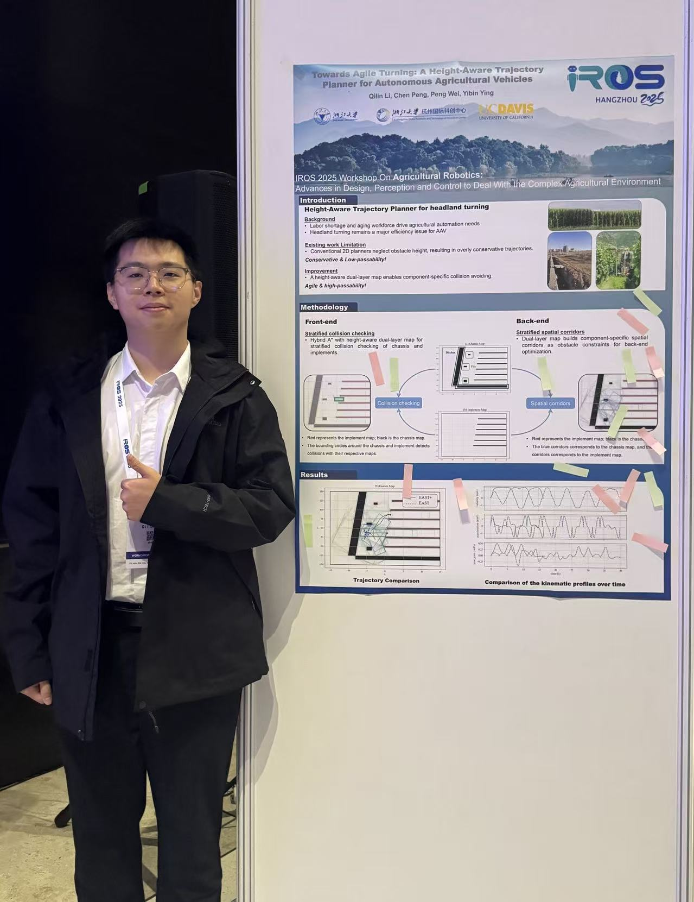

Efficient headland turning for autonomous agricultural vehicles (AAVs) with large, overhanging implements is a critical challenge in confined spaces. Conventional planners, limited by a single 2-D environmental representation, generate overly conservative trajectories because they cannot distinguish obstacle heights. This leads to unnecessary detours around lowlying objects that could be safely passed over. We propose EAST-Planner+, a motion planner that leverages a height-aware model using a dual-layer map. This representation enables precise, component-specific collision checking for the vehicle chassis and the overhanging implement. By exploiting the distinct geometric profiles of these components, our planner generates highly efficient trajectories, significantly improving passability and success rates in headland turning. The effectiveness of our approach is validated through simulations in a narrow headland scenario.

